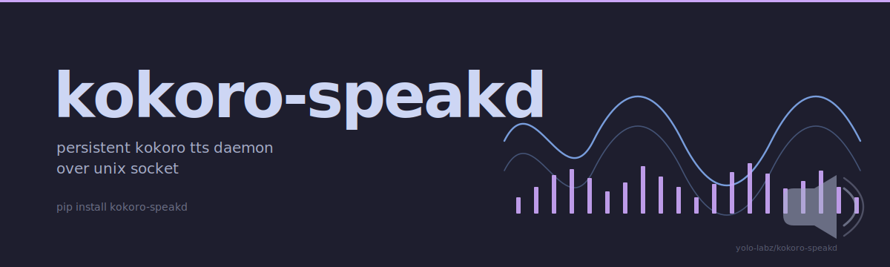

<picture>
  <source media="(prefers-color-scheme: dark)" srcset="docs/assets/hero-dark.svg">
  <source media="(prefers-color-scheme: light)" srcset="docs/assets/hero-light.svg">
  
</picture>

# kokoro-speakd

Persistent [Kokoro TTS](https://github.com/hexgrad/kokoro) daemon for Claude
Code and other clients. Loads the model **once** and serves synthesis requests
over a Unix domain socket, so a machine running 10+ concurrent Claude Code
sessions doesn't pay the cold-start cost on every response.

- **Single process**, single model in RAM, regardless of how many clients.
- **Preemption over queueing** — new speech always cancels older in-flight
  playback, which is what you actually want when juggling many sessions.
- **Lazy per-language pipelines** — default English loads at startup, other
  languages spin up on first use.
- **Nix-first packaging** — `flake.nix` exports both the daemon and a
  stdlib-only client, with `dlinfo`/`en_core_web_sm` workarounds baked in
  so `python3Packages.kokoro` builds cleanly on darwin.
- **Line-delimited JSON protocol** over Unix sockets, trivial to drive from
  any shell or language.

## Capability

**Pattern.** Persistent Kokoro TTS daemon over a Unix socket — one `kokoro-speakd` process holds the Kokoro-82M weights and `en_core_web_sm` phonemizer in RAM; a stdlib-only `kokoro-speak` client speaks line-delimited JSON to it.

**Trade-off.** A 5–8 s cold model load on first boot, in exchange for sub-500 ms warm-call latency on every subsequent `kokoro-speak` invocation. Per-call model reload is avoided entirely, regardless of how many concurrent clients are talking to the daemon.

**Use when.** A Claude Code hook, shell pipeline, or agent loop needs synchronous TTS without paying PyTorch warm-up cost per response — markdown stripping is built in, preemption replaces queueing so the latest thought always wins, and the socket path is stable enough to drop into `Stop` / `SessionEnd` / `UserPromptSubmit` hooks.

```bash
pip install kokoro-speakd                # PyPI (when first release cut)
kokoro-speakd &                          # daemon, single instance per user
echo "hello world" | kokoro-speak        # stdin → speech, ~412 ms warm-call
kokoro-speak < release-notes.md          # markdown → strip → speech
kokoro-speak interrupt                   # cancel in-flight playback
```

## Demo

A non-interactive 18-second `asciinema` cast covering `kokoro-speakd --help`, daemon start with warm-load timing, `kokoro-speak ping`, an inline `echo … | kokoro-speak`, a markdown-stripping `kokoro-speak < file.md`, and `kokoro-speak interrupt` is checked into the repo at [`docs/assets/kokoro-demo.cast`](./docs/assets/kokoro-demo.cast). Replay locally:

```bash
asciinema play docs/assets/kokoro-demo.cast
```

A hosted player embed will land in a follow-up PR after the cast is uploaded to `asciinema.org`.

## How `kokoro-speakd` compares

Closest peers in the open-source TTS-client ecosystem:

| Capability                                       | `kokoro-speakd` (this repo) | [`say`](https://ss64.com/osx/say.html) (macOS native) | [`espeak-ng`](https://github.com/espeak-ng/espeak-ng) | [`piper-tts`](https://github.com/rhasspy/piper) |
|--------------------------------------------------|:---:|:---:|:---:|:---:|
| Persistent daemon (warm-call <500 ms)            | yes | n/a (system service)         | no (per-call process) | manual (no built-in daemon) |
| Quality voice (Kokoro 82M ONNX)                  | yes | yes (macOS voices only)      | no (formant-synth, robotic) | yes |
| Cross-platform (Linux + macOS)                   | yes | no (macOS only)              | yes | yes |
| Markdown → speech preprocessing                  | yes (`markdown.py` strip) | no | no | manual |
| Preemption over queueing (latest thought wins)   | yes | no (queues)                  | no (no queue) | no |
| Lazy per-language pipelines                      | yes | n/a                          | n/a (single back-end) | manual |
| PEP 740 PyPI attestations                        | pending Trusted Publishing wire | n/a | n/a | no |
| Claude Code hook integration documented          | yes (`Stop` / `SessionEnd`) | no | no | no |

For multi-tenant TTS gateways and self-hosted REST services see [`coqui-ai/TTS`](https://github.com/coqui-ai/TTS) or [`openedai-speech`](https://github.com/matatonic/openedai-speech) — different shape of problem, listed in [What this is NOT](#what-this-is-not).

## What this is NOT

- **Not** a multi-tenant TTS SaaS. Each `kokoro-speakd` install is scoped to one user, one model in RAM, one socket.
- **Not** a REST gateway. Use [`coqui-ai/TTS`](https://github.com/coqui-ai/TTS) or [`openedai-speech`](https://github.com/matatonic/openedai-speech) if that's what you want.
- **Not** a real-time streaming TTS. Synthesis runs per-request; preemption swaps the playback target, it does not splice mid-utterance.
- **Not** a voice-cloning tool. Voices are picked from the 54 ONNX models Kokoro ships; bring-your-own-voice is upstream's problem.

## Quick start (with Nix)

```bash
# Start the daemon in the foreground:
nix run github:yolo-labz/kokoro-speakd

# From another terminal:
echo "hello from kokoro" | nix run github:yolo-labz/kokoro-speakd#kokoro-speak
nix run github:yolo-labz/kokoro-speakd#kokoro-speak -- ping
nix run github:yolo-labz/kokoro-speakd#kokoro-speak -- interrupt
```

The first request after a cold daemon start takes ~5–8 seconds while the
PyTorch weights warm up. Every request after that is <500 ms regardless of
how many clients are talking to the daemon.

## Claude Code hook integration (nix-darwin / home-manager)

1. Add the flake as an input:

   ```nix
   kokoro-speakd = {
     url = "github:yolo-labz/kokoro-speakd";
     inputs.nixpkgs.follows = "nixpkgs";
   };
   ```

2. Install the daemon and client on your user, and register a launchd agent
   so the daemon auto-starts at login:

   ```nix
   { inputs, pkgs, system, ... }: let
     kokoro = inputs.kokoro-speakd.packages.${system};
   in {
     home.packages = [ kokoro.kokoro-speak kokoro.kokoro-speakd ];

     launchd.agents.kokoro-speakd = {
       enable = true;
       config = {
         ProgramArguments = [ "${kokoro.kokoro-speakd}/bin/kokoro-speakd" ];
         KeepAlive = true;
         RunAtLoad = true;
         StandardOutPath = "${config.home.homeDirectory}/.cache/claude-code-tts/launchd.out.log";
         StandardErrorPath = "${config.home.homeDirectory}/.cache/claude-code-tts/launchd.err.log";
       };
     };
   }
   ```

3. Point Claude Code's `Stop`, `UserPromptSubmit`, and `SessionEnd` hooks at
   `kokoro-speak` — the daemon handles the rest. See
   [`phsb5321/NixOS`](https://github.com/phsb5321/NixOS/blob/main/modules/home/claude-code.nix)
   for a full reference integration, including the transcript walk that
   pulls Claude's final narrative text out of the JSONL log.

## Protocol

One JSON request per connection, newline-terminated. Response is a single
newline-terminated JSON object.

```json
// speak (replaces any in-flight speech)
{"action": "speak", "text": "hello there", "voice": "af_sky", "lang": "a"}
// -> {"status": "queued", "id": 42}
// -> {"status": "loading"}   // model still warming up
// -> {"status": "empty"}     // text was whitespace after stripping

// cancel current playback
{"action": "interrupt"}
// -> {"status": "ok"}

// health check
{"action": "ping"}
// -> {"status": "pong", "ready": true}
```

Defaults: `voice="af_sky"`, `lang="a"` (American English). Override per
request or globally via `KOKORO_DEFAULT_VOICE` / `KOKORO_DEFAULT_LANG`.

## Environment

**Daemon:**

- `KOKORO_SPEAKD_SOCKET` — socket path (default
  `~/.cache/claude-code-tts/kokoro-speakd.sock`)
- `KOKORO_SPEAKD_LOG` — log file path
- `KOKORO_DEFAULT_VOICE`, `KOKORO_DEFAULT_LANG` — fallback values

**Client (`kokoro-speak`):**

- `KOKORO_VOICE`, `KOKORO_LANG` — per-request overrides
- `KOKORO_MAX` — hard char cap on the text sent (default 5000)
- `KOKORO_SPEAKD_SOCKET` — matching override to reach a non-default daemon

## Voices

Kokoro ships 54 voices. American English defaults to `af_sky`; see
[hexgrad's VOICES.md](https://huggingface.co/hexgrad/Kokoro-82M/blob/main/VOICES.md)
for the full list including British English, Japanese, Mandarin, French,
Italian, and more. Set `KOKORO_VOICE=af_bella` (etc.) and reload the daemon.

## License

MIT. See [LICENSE](./LICENSE).

---

## Services

Compliance-grade AI architecture for regulated workloads — async-first, USD-denominated, LATAM-based / EN-fluent. See [blog.home301server.com.br/services](https://blog.home301server.com.br/services/).
